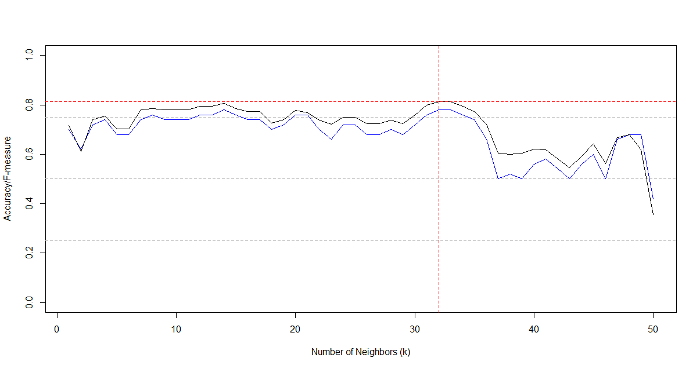

¹ Laboratory of Bioinformatics and Systems, Universidade Federal de Minas Gerais, 31270-901, Belo Horizonte, Brazil – E-mail: diego@dcc.ufmg.br


## Abstract

$\beta$-glucosidases are enzymes with great importance for second-generation biofuel production. They act together with endoglucases and exoglucanases to extract fermentable glucose from lignocellulose biomass. However, most $\beta$-glucosidases have been described as strongly inhibited by high glucose concentrations, which is a limitation for industrial production. Also, for industrial applications, thermostable enzymes with high optimal temperature are required. Hence, the search for glucose resistant and thermostable $\beta$-glucosidases have been the target of several studies. In this study, I propose a comparison of $\beta$-glucosidases obtained from thermophilic organisms and non-thermophilic using machine learning. I hypothesized that $\beta$-glucosidases derived from thermophilic organisms should present a high resistance to high temperatures. Therefore, they are potential targets for biofuel production in industrial applications. To verify this, I collected two hundred 3D-structures of GH1 $\beta$-glucosidases from Glutantbase, a database of $\beta$-glucosidase structures modeled by comparison (one hundred structures from thermophilic and one hundred from non-thermophilic). I used aCSM tool to construct structural signatures (fingerprints) for each $\beta$-glucosidase. Each signature is composed of 576 predictors that represent pair-wise distance vectors of atoms and their pharmacophoric properties. aCSM generated a matrix of 200 lines and 576 columns, which as imported for RStudio and divided into two datasets: (i) train (100 lines: 50 thermophilic and 50 non-thermophilic), and (ii) test (100 lines: 50 thermophilic and 50 non-thermophilic). For parametrization, the training dataset was divided into other two sub-datasets of the same length: (i) train_final and (ii) validation. I used the validation dataset to define the best k value for k-nearest neighbors (KNN) classification testing k values ranging from 1 to 99. The best value was k = 32 (accuracy of 0.78 and an F-measure of 0.81). Then, I constructed a model using the whole training dataset with the KNN algorithm (only for k = 32). It was obtained for accuracy, sensitivity, specificity, and F-measure the values of 0.79, 0.78, 0.80, and 0.79, respectively. The outcome demonstrates that $\beta$-glucosidase enzymes from thermophilic organisms appear to present similar internal patterns in their structures. The model constructed here as the potential to detect proteins with similar characteristics in other organisms, once thermophilic organisms are hardly cultured in vitro. I hope the results presented here could improve the rational design of enzymes for second-generation biofuel production.


## Introduction

Second-generation biofuels are a green and clean alternative source of energy. They are produced from lignocellulose biomass, such as corn, algae, soy, and sugarcane [1–3]. For the conversion of biomass into ethanol fuel occurs, many steps are necessary; for example, pre-processing (lignocellulose biomass is prepared), saccharification (glucose is extracted from biomass), and fermentation (glucose is converted in ethanol fuel) [4–6]. The saccharification step occurs by the action of three enzymes: (i) endoglucases (E.C. 3.2.1.4), responsible to extract oligosaccharides from cellulose structure; (ii) exoglucanases (E.C. 3.2.1.91), responsible to release disaccharides (mainly cellobiose); and (iii) $\beta$-glucosidases (E.C. 3.2.1.21), responsible to cleave the glycosidic linking of cellobiose, releasing two molecules of glucose [7, 8]. $\beta$-glucosidases have been described in the literature as the main bottleneck for the production of biofuel in industrial applications [9]. Most $\beta$-glucosidases have been described as strongly inhibited by high glucose concentrations in the process of self-inhibition [4, 5, 10]. Thus, enzymes cocktails are necessary for large industrial applications, which increases the production costs. A promising strategy to reduce costs is the simultaneous saccharification and fermentation (SFF), where both processes occur at the same time, producing higher ethanol yields with lower energy consumption [11]. However, this process has some drawbacks, such as the different optimal temperature of saccharification and fermentation [6]. This highlights the importance of thermostable enzymes with high optimal temperature for biofuel production in industrial levels [12].

The search for glucose resistant and thermostable $\beta$-glucosidases have been the target of several studies [4, 5, 8, 13–34]. In a recent study, structural signatures and machine learning have been used to characterize enzymes with high potential to biofuel production and detect sites for point mutations that induce glucose tolerance [35]. Also, site-direct mutagenesis has been used in in vitro experiments to improve the thermostability of $\beta$-glucosidases enzymes. 

Thermophilic organisms are potential sources of thermostable enzymes [36]. Although much genomic information of these organisms has been available due to the reduction of metagenome sequencing costs, these organisms are hardly cultured in laboratories due to the extreme temperatures of the environments where they naturally live [8]. In addition, the public data of enzymes from thermophilic enzymes could be used to construct models to detect enzymes thermoresistant. To the best of our knowledge, in silico approaches based on structural signatures and machine learning have not been used for detecting thermostable enzymes or mutation sites. 
	
In this study, I propose a comparison of $\beta$-glucosidases obtained from thermophilic organisms and non-thermophilic using machine learning. I hypothesized that $\beta$-glucosidases from thermophilic organisms should present a high resistance to high temperatures. Therefore, they are potential targets for biofuel production in industrial applications. Also, the construction of a model could be used to detect proteins with similar structural characteristics to thermophilic in non-thermophilic organisms. In the next section, I present the strategies used for collecting data, detecting fingerprints in their 3D-structure, and constructing the models used to detect thermostable $\beta$-glucosidase enzymes. 


## Methods

### Data collection

Two hundred 3D-structures of GH1 $\beta$-glucosidases were randomly selected from Glutantbase. This is a public database of $\beta$-glucosidase structures modeled by comparison (available at <http://bioinfo.dcc.ufmg.br/Glutantbase>). Glutantbase only contains proteins from glycoside hydrolase family 1 (GH1), which present a conserved TIM-barrel folding (with a length of approximately 400 amino acids residues). Glutantbase stores 3,553 GH1 $\beta$-glucosidases structures, but a preliminary analysis demonstrated that only 126 could be from thermophilic organisms. For detecting thermophilic organisms, I searched for the presence of the substring “%therm%” into the organism name using SQL scripts and the MySQL workbench tool (for instance, Thermoanaerobacter thermohydrosulfuricus WC1 $\beta$-glucosidase was included). For detecting non-thermophilic organisms, I searched for organisms’ names without the presence of the same substring. I selected one hundred structures to represent $\beta$-glucosidases extracted from thermophilic organisms plus one hundred from non-thermophilic. Each protein 3D-structure was downloaded in the PDB format, where lines started with ATOM represent atoms coordinates and their types. A complete list of enzymes collected is available at the supplementary material.


### Representative vectors construction

To represent each collected $\beta$-glucosidase protein as a continuous vector, I used aCSM tool [37]. This tool detects structural signatures (also called fingerprints), which are unique numerical vectors obtained from pairwise distances between protein atoms and their pharmacophoric properties. They have been used to detect differences and similarities among proteins.

aCSM tool computes the distances between all atoms of protein and constructs a pairwise distance matrix. Then, it calculates the number of atom pairs in a variated range of cutoff. Four parameters was used for aCSM: 

(i) initial distance cutoff: 0 Å; 

(ii) last distance cutoff: 30 Å; 

(iii) step distance cutoff: 2 Å;  

(iv) signature type: 2 (aCSM-all). 

This means that aCSM will calculate the number of atom pairs located in coordinates between 0 and 2 Å, 2-4 Å, 4-6 Å, 6-8 Å, […], 26-28 Å, 28-30 Å (from 0 to 30 Å, variating 2 Å by turn). Also, aCSM analyzes the pharmacophoric properties (for the signature type 2: aCSM-all). For instance, if the possible interaction between the atoms is classified as hydrophobic, positively charged, negatively charged, hydrogen acceptor, hydrogen donor, aromatic, sulfur, or neutral [37]. The parameters used here were defined based on the work of Pires et al. [38].
	
For each protein submitted as input, aCSM returns a vector with 576 descriptors saved in a CSV files (two files were created: “t.csv” for thermophilic and “nt.csv” for non-thermophilic). These files were imported in RStudio and converted into a matrix of 200 lines for 576 columns. This matrix was divided was divided into two datasets: (i) “train” (with one hundred lines: fifty representing thermophilic plus fifty representing non-thermophilic), and (ii) “test” (with one hundred lines too: fifty representing thermophilic plus fifty representing non-thermophilic). 


```{r eval=FALSE, message=F}

# packages
if(!require(tidyverse)) install.packages(
  "tidyverse",
  repos = "http://cran.us.r-project.org"
)

if(!require(caret)) install.packages(
  "caret", 
  repos = "http://cran.us.r-project.org"
)

if(!require(data.table)) install.packages(
  "data.table",
  repos = "http://cran.us.r-project.org"
)


#importing data - t=therm* - nt=non-therm*
t = read.csv("t.csv", header=FALSE)
nt = read.csv("nt.csv", header=FALSE)

# separing train and test 50/50
t_train = t[1:50,]
t_test = t[51:100,]

nt_train = nt[1:50,]
nt_test = nt[51:100,]

# joining train and test
train = rbind(t_train,nt_train)
test = rbind(t_test,nt_test)

```

A label variable was created to identify the lines, where “t” represents thermophilic and “nt” non-thermophilic.


```{r eval=FALSE}

# labels
l1 = matrix(nrow=50, data="t")
l2 = matrix(nrow=50, data="nt")
labels = rbind(l1,l2)

```

## Machine learning parametrization and model construction

For defining the parameters used for the classification step, the training dataset was divided into other two sub-datasets of the same length: (i) train_final, and (ii) validation. 


```{r eval=FALSE}

# separing train: (1) train_final and (2) validation
train_final = rbind(train[1:25, ],train[51:75, ])
validation = rbind(train[26:50, ],train[76:100, ]) 

label_train_final = c(labels[1:25, ],labels[51:75, ])
label_validation = c(labels[26:50, ],labels[76:100, ])

```

The k-nearest neighbors (KNN) was the algorithm defined to construct the model. I used the validation dataset to define the best k value for KNN classification, testing k values ranging from 1 to 50. 


```{r eval=FALSE}

# Calculating KNN
acc = c()
sens = c()
spec = c()
fmea = c()

# determining the best k value for knn 
for(k in 1:50){
  knn_fit = knn3(train_final, factor(label_train_final), k = k)
  y_hat_knn = predict(knn_fit, validation, type="class")
  
  a = confusionMatrix(
    data=y_hat_knn, 
    reference = factor(label_validation)
  )$overall['Accuracy']
  
  acc = c(acc,mean(y_hat_knn == label_validation))
  spec = c(spec,specificity(factor(y_hat_knn), factor(label_validation)))
  sens = c(sens,sensitivity(factor(y_hat_knn), factor(label_validation)))
  fmea = c(fmea, F_meas(data=factor(y_hat_knn), reference=factor(label_validation)))
  
}
plot(
  acc, 
  type="n", 
  col="blue", 
  ylim=c(0,1), 
  ylab="Accuracy/F-measure", 
  xlab="Number of Neighbors (k)"
)
abline(h=c(0.25,0.5,0.75), col="grey", lty="dashed")
lines(acc, type="l", col="blue", lty="solid")
lines(fmea, type="l", col="black", lty="solid" )
abline(h=0.8135, col="red", lty="dashed")
abline(v=c(32), col="red", lty="dashed")

```




The best value was k = 32 with an accuracy of 0.78 and F-measure of 0.8135. Hence, I used k = 32 for the model construction.


```{r eval=FALSE}

knn_fit = knn3(train, factor(labels), k = 32)
y_hat_knn = predict(knn_fit, test, type="class")


```

![Project’s overview. Two hundred structural signatures (each one with 576 descriptors) were used as input. They represent $\beta$-glucosidases obtained from a thermophilic (t) and non-thermophilic (nt) organisms (one hundred of each type). The signatures were divided into two groups, called “train” and “test”. For defining the parameters used for constructing the model, I divided the “train” dataset into two sub-datasets and performed KNN classification using k-values ranging from 1 to 50. The parameter k=32 obtained the highest F-measure (0.81) and overall accuracy (0.78). Thus, this k-value was used to construct the model using the whole “train” dataset and “test” dataset.](./overview.png)


## Results and discussion

In Figure 2, I present a general vision of the project.For the model constructed, I obtained for accuracy, sensitivity, specificity, and F-measure the values of 0.79, 0.78, 0.80, and 0.79, respectively (p-value of 2.169e-09).  For the 50 enzymes from thermophilic organisms, 40 was classified in the thermophilic group. Only ten were classified in the non-thermophilic groups. Also, for the 50 enzymes from non-thermophilic organisms, 39 was classified in the non-thermophilic group and 11 in the thermophilic group. However, false positives could be interesting enzymes to be studied. 


```{r eval=FALSE}

confusionMatrix(data=y_hat_knn, reference = factor(labels))

```


**Confusion Matrix and Statistics**

          Reference
Prediction nt  t
        nt 39 10
        t  11 40
                                          
               Accuracy : 0.79            
                 95% CI : (0.6971, 0.8651)
    No Information Rate : 0.5             
    P-Value [Acc > NIR] : 2.169e-09       
                                          
                  Kappa : 0.58            
                                          
 Mcnemar's Test P-Value : 1               
                                          
            Sensitivity : 0.7800          
            Specificity : 0.8000          
         Pos Pred Value : 0.7959          
         Neg Pred Value : 0.7843          
             Prevalence : 0.5000          
         Detection Rate : 0.3900          
   Detection Prevalence : 0.4900          
      Balanced Accuracy : 0.7900          
                                          
       'Positive' Class : nt           


As a case study, let’s compare a thermophilic classified correctly with a non-thermophilic classified as thermophilic (Figure 3). For this case study, I chose the $\beta$-glucosidase of Thermus thermophilus (thermophilic) and the $\beta$-glucosidase of Lactobacillus paracasei (non-thermophilic). Both $\beta$-glucosidases present similar structure folding, but only 30% of sequence identity (considered a low value). However, 49% of the amino acids matched were considered positive when aligned using the matrix BLOSUM62 in BLASTP software [39, 40]. The $\beta$-glucosidase of Thermus thermophilus has been described in the literature as a target for industrial applications [41]. Besides, enzymes from highly thermophilic organisms have been used as a reference for the engineering of thermostable enzymes with industrial applications [36].  Although much information is available to T. thermophilus $\beta$-glucosidase, including a 3D-structure solved by crystallography (PDB: 3ZJK), little information is available for L. paracasei $\beta$-glucosidase. Hence, our results indicate that L. paracasei is potential target for industrial biofuel applications and should be evaluated by experimental essays.
 

![Comparisons between $\beta$-glucosidase of Thermus thermophilus, a thermophilic classified correctly, and $\beta$-glucosidase of Lactobacillus paracasei, a non-thermophilic classified as thermophilic. (A) Structural alignment between T. thermophilus (protein backbone is shown as a cartoon in salmon color) and L. paracasei (protein backbone is shown as a cartoon in cyan color). Both catalytic glutamates are shown as sticks in the center of the figure (E164/E166 and E368/E366).  (B) Sequence alignment. Uniprot IDs: T. thermophilus - Q9RA61; L. paracasei - K6RUM4. They present only 30% of identity (137 \ 453), but 49% of the amino acids match were considered positive (224 / 453). Structural alignment was performed using PyMol (42). Sequence alignment generated using Clustal Omega (43).](./t_nt.png)


## Conclusion

Here, I used machine learning to construct a model for detecting thermostable enzymes with potential for industrial applications. The model built obtained for accuracy, sensitivity, specificity, and F-measure values of 0.79, 0.78, 0.80, and 0.79, respectively. The outcome demonstrates that $\beta$-glucosidase enzymes from thermophilic organisms appear to present similar internal patterns in their structures. Previous studies have detected the potential of structural signatures for clustering enzymes used in biofuel production [35]. To the best of our knowledge, this is the first report of machine learning used to detected thermostability patterns in three-dimensional structures of $\beta$-glucosidase enzymes based on structural signatures. The model constructed here as the potential to detect proteins with similar characteristics in other traditional organisms, once thermophilic organisms are hardly cultured in vitro. I hope the results presented here could improve the rational design of thermostable enzymes for second-generation biofuel production.


## Acknowledgments

The author thanks professor Rafael Irizarry for the valuable teachings in R classes and apologizes for taking so much time to finish this report (due to getting stuck in simple command lines in R). The author also thanks to all the edX staff and the students that reviewed the projects, especially to the people that read this huge report until this point.


## References 

1. Mariano DCB, Leite C, Santos LHS, Marins LF, Machado KS, Werhli AV, et al. Characterization of glucose-tolerant $\beta$-glucosidases used in biofuel production under the bioinformatics perspective: a systematic review. Genet Mol Res. 2017;16.
2. Cairns JRK, Esen A. $\beta$-Glucosidases. Cellular and Molecular Life Sciences. 2010;67:3389–405.
3. Costa LSC, Mariano DCB, Rocha REO, Kraml J, Silveira CH da, Liedl KR, et al. Molecular Dynamics Gives New Insights into the Glucose Tolerance and Inhibition Mechanisms on $\beta$-Glucosidases. Molecules. 2019;24:3215.
4. de Giuseppe PO, Souza T de ACB, Souza FHM, Zanphorlin LM, Machado CB, Ward RJ, et al. Structural basis for glucose tolerance in GH1 $\beta$-glucosidases. Acta Crystallographica Section D Biological Crystallography. 2014;70:1631–9.
5. Yang Y, Zhang X, Yin Q, Fang W, Fang Z, Wang X, et al. A mechanism of glucose tolerance and stimulation of GH1 $\beta$-glucosidases. Scientific Reports. 2015;5:17296.
6. Meleiro LP, Salgado JCS, Maldonado RF, Alponti JS, Zimbardi ALRL, Jorge JA, et al. A Neurospora crassa ß-glucosidase with potential for lignocellulose hydrolysis shows strong glucose tolerance and stimulation by glucose and xylose. Journal of Molecular Catalysis B: Enzymatic. 2015;122:131–40.
7. Saha BC, Bothast RJ. Production, purification, and characterization of a highly glucose-tolerant novel $\beta$-glucosidase from Candida peltata. Applied and Environmental Microbiology. 1996;62:3165–3170.
8. Cao L, Wang Z, Ren G, Kong W, Li L, Xie W, et al. Engineering a novel glucose-tolerant $\beta$-glucosidase as supplementation to enhance the hydrolysis of sugarcane bagasse at high glucose concentration. Biotechnology for Biofuels. 2015;8.
9. Sørensen A, Lübeck PS, Lübeck M, Teller PJ, Ahring BK. $\beta$-Glucosidases from a new Aspergillus species can substitute commercial $\beta$-glucosidases for saccharification of lignocellulosic biomass. Can J Microbiol. 2011;57:638–50.
10. Bohlin C, Olsen SN, Morant MD, Patkar S, Borch K, Westh P. A comparative study of activity and apparent inhibition of fungal $\beta$-glucosidases. Biotechnol Bioeng. 2010;107:943–52.
11. Weiss PH, Álvares AC, Gomes AA, Miletti LC, Skoronski E, da Silva GF, et al. $\beta$ glucosidase from Bacillus polymyxa is activated by glucose-6-phosphate. Archives of biochemistry and biophysics. 2015;580:50–6.
12. Badal C. Saha, Shelby N. Freer, Rodney J. Bothast. Thermostable ?-Glucosidases. In: Enzymatic Degradation of Insoluble Carbohydrates. American Chemical Society; 1996. p. 197–207.
13. Chamoli S, Kumar P, Navani NK, Verma AK. Secretory expression, characterization and docking study of glucose-tolerant $\beta$-glucosidase from B. subtilis. International Journal of Biological Macromolecules. 2016;85:425–33.
14. Crespim E, Zanphorlin LM, de Souza FHM, Diogo JA, Gazolla AC, Machado CB, et al. A novel cold-adapted and glucose-tolerant GH1 $\beta$-glucosidase from Exiguobacterium antarcticum B7. International Journal of Biological Macromolecules. 2016;82:375–80.
15. Uchiyama T, Yaoi K, Miyazaki K. Glucose-tolerant $\beta$-glucosidase retrieved from a Kusaya gravy metagenome. Frontiers in Microbiology. 2015;6.
16. Yang F, Yang X, Li Z, Du C, Wang J, Li S. Overexpression and characterization of a glucose-tolerant $\beta$-glucosidase from T. aotearoense with high specific activity for cellobiose. Applied Microbiology and Biotechnology. 2015;99:8903–15.
17. Ramani G, Meera B, Vanitha C, Rajendhran J, Gunasekaran P. Molecular cloning and expression of thermostable glucose-tolerant $\beta$-glucosidase of Penicillium funiculosum NCL1 in Pichia pastoris and its characterization. Journal of Industrial Microbiology & Biotechnology. 2015;42:553–65.
18. Thongpoo P, Srisomsap C, Chokchaichamnankit D, Kitpreechavanich V, Svasti J, Kongsaeree PT. Purification and characterization of three $\beta$-glycosidases exhibiting high glucose tolerance from Aspergillus niger ASKU28. Bioscience, Biotechnology, and Biochemistry. 2014;78:1167–76.
19. Teugjas H, Väljamäe P. Selecting $\beta$-glucosidases to support cellulases in cellulose saccharification. Biotechnology for biofuels. 2013;6:1.
20. Lu J, Du L, Wei Y, Hu Y, Huang R. Expression and characterization of a novel highly glucose-tolerant $\beta$-glucosidase from a soil metagenome. Acta Biochimica et Biophysica Sinica. 2013;45:664–73.
21. Rajasree KP, Mathew GM, Pandey A, Sukumaran RK. Highly glucose tolerant $\beta$-glucosidase from Aspergillus unguis: NII 08123 for enhanced hydrolysis of biomass. Journal of Industrial Microbiology & Biotechnology. 2013;40:967–75.
22. Singhania RR, Patel AK, Sukumaran RK, Larroche C, Pandey A. Role and significance of $\beta$-glucosidases in the hydrolysis of cellulose for bioethanol production. Bioresource Technology. 2013;127:500–7.
23. Souza FHM, Meleiro LP, Machado CB, Zimbardi ALRL, Maldonado RF, Souza TACB, et al. Gene cloning, expression and biochemical characterization of a glucose- and xylose-stimulated $\beta$-glucosidase from Humicola insolens RP86. Journal of Molecular Catalysis B: Enzymatic. 2014;106:1–10.
24. Pei J, Pang Q, Zhao L, Fan S, Shi H. Thermoanaerobacterium thermosaccharolyticum $\beta$-glucosidase: a glucose-tolerant enzyme with high specific activity for cellobiose. Biotechnol Biofuels. 2012;5:1–10.
25. Uchima CA, Tokuda G, Watanabe H, Kitamoto K, Arioka M. Heterologous Expression in Pichia pastoris and Characterization of an Endogenous Thermostable and High-Glucose-Tolerant $\beta$-Glucosidase from the Termite Nasutitermes takasagoensis. Applied and Environmental Microbiology. 2012;78:4288–93.
26. Ramani G, Meera B, Vanitha C, Rao M, Gunasekaran P. Production, Purification, and Characterization of a $\beta$-Glucosidase of Penicillium funiculosum NCL1. Applied Biochemistry and Biotechnology. 2012;167:959–72.
27. Jabbour D, Klippel B, Antranikian G. A novel thermostable and glucose-tolerant $\beta$-glucosidase from Fervidobacterium islandicum. Applied Microbiology and Biotechnology. 2012;93:1947–56.
28. Liu J, Zhang X, Fang Z, Fang W, Peng H, Xiao Y. The 184th residue of $\beta$-glucosidase Bgl1B plays an important role in glucose tolerance. Journal of Bioscience and Bioengineering. 2011;112:447–50.
29. Fang Z, Fang W, Liu J, Hong Y, Peng H, Zhang X, et al. Cloning and Characterization of a $\beta$-Glucosidase from Marine Microbial Metagenome with Excellent Glucose Tolerance. JOURNAL OF MICROBIOLOGY AND BIOTECHNOLOGY. 2010;20:1351–8.
30. Guo B, Amano Y, Nozaki K. Improvements in Glucose Sensitivity and Stability of Trichoderma reesei $\beta$-Glucosidase Using Site-Directed Mutagenesis. PLOS ONE. 2016;11:e0147301.
31. Souza FHM, Inocentes RF, Ward RJ, Jorge JA, Furriel RPM. Glucose and xylose stimulation of a $\beta$-glucosidase from the thermophilic fungus Humicola insolens: A kinetic and biophysical study. Journal of Molecular Catalysis B: Enzymatic. 2013;94:119–28.
32. Meleiro LP, Zimbardi ALRL, Souza FHM, Masui DC, Silva TM, Jorge JA, et al. A novel $\beta$-glucosidase from Humicola insolens with high potential for untreated waste paper conversion to sugars. Appl Biochem Biotechnol. 2014;173:391–408.
33. Cota J, Corrêa TLR, Damásio ARL, Diogo JA, Hoffmam ZB, Garcia W, et al. Comparative analysis of three hyperthermophilic GH1 and GH3 family members with industrial potential. New Biotechnology. 2015;32:13–20.
34. Breves R, Bronnenmeier K, Wild N, Lottspeich F, Staudenbauer WL, Hofemeister J. Genes encoding two different $\beta$-glucosidases of Thermoanaerobacter brockii are clustered in a common operon. Applied and environmental microbiology. 1997;63:3902–3910.
35. Mariano D, Santos LH, Machado KDS, Werhli AV, de Lima LHF, de Melo-Minardi RC. A Computational Method to Propose Mutations in Enzymes Based on Structural Signature Variation (SSV). Int J Mol Sci. 2019;20.
36. Hassan N, Geiger B, Gandini R, Patel BKC, Kittl R, Haltrich D, et al. Engineering a thermostable Halothermothrix orenii $\beta$-glucosidase for improved galacto-oligosaccharide synthesis. Appl Microbiol Biotechnol. 2016;100:3533–43.
37. Pires DEV, de Melo-Minardi RC, da Silveira CH, Campos FF, Meira W. aCSM: noise-free graph-based signatures to large-scale receptor-based ligand prediction. Bioinformatics. 2013;29:855–61.
38. Pires DEV. CSM: uma assinatura para grafos biológicos baseada em padrões de distâncias. UFMG; 2012. http://www.pgbioinfo.icb.ufmg.br/defesas/41D.PDF.
39. Johnson M, Zaretskaya I, Raytselis Y, Merezhuk Y, McGinnis S, Madden TL. NCBI BLAST: a better web interface. Nucleic Acids Res. 2008;36 Web Server issue:W5-9.
40. Stephen F. AltschuP, Warren Gish~, Webb Miller2 Eugene W. Myers 3 and David J. Lipman. Basic Local Alignment Search Tool. 1990.
41. Teze D, Hendrickx J, Czjzek M, Ropartz D, Sanejouand Y-H, Tran V, et al. Semi-rational approach for converting a GH1 $\beta$-glycosidase into a $\beta$-transglycosidase. Protein Eng Des Sel. 2014;27:13–9.
42. Schrödinger, LLC. The PyMOL Molecular Graphics System, Version 1.8. 2015.
43. Sievers F, Higgins DG. Clustal omega. Curr Protoc Bioinformatics. 2014;48:3.13.1-16.


## Supplementary Material

**Script 1**. Script SQL used to select $\beta$-glucosidases structures from non-thermophilic organisms.


```{r eval=FALSE}

SELECT *
FROM PROTEINS
WHERE organism NOT LIKE "%therm%"
ORDER BY RAND( )
LIMIT 100

```


**Script 2**. Script SQL used to select $\beta$-glucosidases structures from non-thermophilic organisms.


```{r eval=FALSE}

SELECT *
FROM PROTEINS
WHERE organism LIKE "%therm%"
ORDER BY RAND( )
LIMIT 100

```


**Table 1**. List of $\beta$-glucosidases obtained from organisms classified as non-thermophilic in this study. 

Source: http://bioinfo.dcc.ufmg.br/glutantbase/index.php/protein/id/<UniprotID>

---------------------------------------------------
 	**UNIPROT ID	ORGANISM	LENGTH	PREDICTION**
---------------------------------------------------
 	
1	A0A0W1L3I4	Pseudoalteromonas sp. 10-33	442	-

2	D5KX75	uncultured bacterium	442	-

3	G5IHC4	Hungatella hathewayi WAL-18680	461	-

4	A0A0A0JPW7	Knoellia subterranea KCTC 19937	464	-

5	A0A139NFW8	Streptococcus sp. DD10	479	-

6	G0Q8E5	Streptomyces sp. ACT-1	485	-

7	A0A014LC96	Streptomyces sp. PRh5	468	-

8	A0A0Q6TZA9	Pelomonas sp. Root1217	449	-

9	C6Y1A3	Pedobacter heparinus (strain ATCC 13125 / DSM 2366 / CIP 104194 / JCM 7457 / NBRC 12017 / NCIMB 9290 / NRRL B-14731 / HIM 762-3)	445	-

10	A0A066Y8A5	Streptomyces olindensis	488	-

11	A0A0W1L3T4	Pseudoalteromonas sp. 10-33	442	-

12	A0A0N1AA72	Rhizobium sp. AAP43	457	-

13	K2LMK5	Thalassospira profundimaris WP0211	443	-

14	A0A0D2MNY3	Monoraphidium neglectum	539	-

15	K6QJK5	Lactobacillus casei 32G	476	-

16	I7EUV9	Phaeobacter inhibens (strain ATCC 700781 / DSM 17395 / CIP 105210 / JCM 21319 / NBRC 16654 / NCIMB 13546 / BS107)	444	-

17	R1CUK8	Caldisalinibacter kiritimatiensis	444	-

18	A0A085H4A7	Hafnia alvei ATCC 13337	467	-

19	Q21ZF1	Rhodoferax ferrireducens (strain ATCC BAA-621 / DSM 15236 / T118)	456	-

20	A0A0D0EF31	Flavobacterium hibernum	450	-

21	G6FBI5	Lactococcus lactis subsp. lactis CNCM I-1631	478	-

22	A0A0H3NVV8	Yersinia enterocolitica subsp. palearctica serotype O:3 (strain DSM 13030 / CIP 106945 / Y11)	466	-

23	I0L7W2	Micromonospora lupini str. Lupac 08	447	-

24	A0A0I5H012	Streptococcus pneumoniae	471	-

25	A0A0K2SK68	Limnochorda pilosa	445	-

26	A0A0N7FUC0	Gordonia phthalatica	452	-

27	D7CRB8	Truepera radiovictrix (strain DSM 17093 / CIP 108686 / LMG 22925 / RQ-24)	458	-

28	A0A0M7QM17	Streptomyces venezuelae	480	-

29	A4U0J3	Magnetospirillum gryphiswaldense	466	-

30	A0A0K3BB21	Kibdelosporangium sp. MJ126-NF4	383	-

31	A0A0C2BEE0	Streptomyces sp. 150FB	475	-

32	A0A0Q6YIM5	Streptomyces sp. Root369	479	-

33	A0A0Q8CF54	Leifsonia sp. Root60	482	-

34	A0A0J6DJV4	Cellulomonas sp. A375-1	481	-

35	A0A072CG79	Rhizobium leguminosarum bv. phaseoli CCGM1	459	-

36	U7G846	Labrenzia sp. C1B10	452	-

37	C5EP49	Clostridiales bacterium 1_7_47FAA	472	-

38	A0A154UZW3	Clavibacter tessellarius	499	-

39	E1LQA9	Streptococcus mitis SK597	459	-

40	A0A059WHP2	Periplaneta americana	505	-

41	B9RI70	Ricinus communis	500	-

42	A0A0Q7BD61	Pelomonas sp. Root405	455	-

43	A0A0D0WQW4	Micromonospora carbonacea	499	-

44	A0A0M8WYZ7	Streptomyces sp. NRRL WC-3723	475	-

45	A0A0Q8WCX9	Aeromicrobium sp. Root236	453	-

46	A0A0B5HY92	Streptomyces vietnamensis	466	-

47	A0A0C2W2Y2	Jeotgalibacillus campisalis	451	-

48	Q11NH0	Cytophaga hutchinsonii (strain ATCC 33406 / NCIMB 9469)	462	-

49	A0A151QXB7	Cajanus cajan	509	-

50	A0A0Q8AIT6	Microbacterium sp. Root166	489	-

51	K6RUM4	Lactobacillus casei UCD174	476	t

52	F1TE14	[Clostridium] papyrosolvens DSM 2782	450	nt

53	A0A099JMJ2	Cryobacterium roopkundense	474	nt

54	Q75I94	Oryza sativa subsp. japonica	568	nt

55	A0A085K4X8	Sphingobium yanoikuyae	483	nt

56	X5K473	Elizabethkingia anophelis	444	t

57	W2VAQ7	Bifidobacterium sp. MSTE12	455	nt

58	B1VQ99	Streptomyces griseus subsp. griseus (strain JCM 4626 / NBRC 13350)	446	nt

59	I2CBS4	Bacillus amyloliquefaciens Y2	466	t

60	Q2QSR8	Oryza sativa subsp. japonica	492	t

61	A0A098UII0	Massilia sp. JS1662	432	nt

62	A0A0P0MBL4	Limnohabitans sp. 63ED37-2	451	nt

63	V9ZZ66	Aeromonas hydrophila 4AK4	477	nt

64	A0A0Q8USD4	Nocardioides sp. Root224	452	nt

65	A0A101TCI3	Streptomyces bungoensis	454	nt

66	A0A0L0KNJ9	Streptomyces acidiscabies	477	nt

67	A4AFR4	marine actinobacterium PHSC20C1	472	nt

68	D6ETZ7	Streptomyces lividans TK24	459	nt

69	A0A0T7FU31	Neorhizobium galegae bv. officinalis	478	t

70	B9RAJ3	Ricinus communis	481	nt

71	A0A081EFN3	Streptomyces fradiae	475	nt

72	A0A124C423	Streptomyces scabiei	429	nt

73	N0DY37	Tetrasphaera elongata Lp2	456	nt

74	H5YQE7	Bradyrhizobium sp. WSM471	487	nt

75	A0A0N0YNN0	Streptomyces sp. NRRL S-4	485	nt

76	A0A0T8THB7	Streptococcus pneumoniae	459	t

77	A0A0U1AB91	Mycobacteroides abscessus	469	nt

78	A0A146GCV4	Terrimicrobium sacchariphilum	447	nt

79	A0A0R3MMQ8	Bradyrhizobium lablabi	493	nt

80	A0A0T8KCR7	Streptococcus pneumoniae	476	nt

81	W1EPA2	Klebsiella pneumoniae IS53	466	t

82	A0A0F0H1R8	Lechevalieria aerocolonigenes	455	nt

83	I0KZ53	Micromonospora lupini str. Lupac 08	477	nt

84	A0A146G1V6	Terrimicrobium sacchariphilum	475	t

85	I3SYX2	Medicago truncatula	493	nt

86	A0A146G7S6	Terrimicrobium sacchariphilum	461	nt

87	A0A0S9DWR5	Agreia sp. Leaf244	491	nt

88	F5XLS1	Microlunatus phosphovorus (strain ATCC 700054 / DSM 10555 / JCM 9379 / NBRC 101784 / NCIMB 13414 / VKM Ac-1990 / NM-1)	415	nt

89	A0A0F2TGG7	Streptomyces rubellomurinus (strain ATCC 31215)	447	nt

90	E7FMU7	Lactobacillus ruminis ATCC 25644	460	t

91	A0A0Q6X661	Streptomyces sp. Root369	440	nt

92	A0A101TH24	Streptomyces caeruleatus	448	nt

93	S4XL86	Sorangium cellulosum So0157-2	463	nt

94	M2YAZ1	Amycolatopsis decaplanina DSM 44594	453	nt

95	J9Z024	alpha proteobacterium HIMB59	457	t

96	Q9FYS3	Secale cereale	568	nt

97	A0A0Q6WXJ2	Pelomonas sp. Root1237	447	nt

98	I6ARU5	Opitutaceae bacterium TAV1	465	t

99	C9Z448	Streptomyces scabiei (strain 87.22)	480	nt

100	Q42618	Brassica napus	514	nt


**Table 2**. List of $\beta$-glucosidases obtained from organisms classified as thermophilic in this study. 

Source: http://bioinfo.dcc.ufmg.br/glutantbase/index.php/protein/id/<UniprotID>


---------------------------------------------------
**UNIPROT ID	ORGANISM		LENGTH		PREDICTION**
---------------------------------------------------
1	Q60026	Thermoanaerobacter brockii	450		-

2	P0C946	Thermotoga neapolitana	425		-

3	Q9RA58	Thermus sp. Z-1	423		-

4	Q9LAV5	Thermobifida fusca	484		-

5	L0EHU9	Thermobacillus composti (strain DSM 18247 / JCM 13945 / KWC4)	450		-

6	D1A786	Thermomonospora curvata (strain ATCC 19995 / DSM 43183 / JCM 3096 / NBRC 15933 / NCIMB 10081 / Henssen B9)	447		-

7	Q9L794	Thermus nonproteolyticus	436		-

8	D6YBP8	Thermobispora bispora (strain ATCC 19993 / DSM 43833 / CBS 139.67 / JCM 10125 / NBRC 14880 / R51)	439		-

9	Q8GEB3	Thermus thermophilus	431		-

10	E8N3Y4	Anaerolinea thermophila (strain DSM 14523 / JCM 11388 / NBRC 100420 / UNI-1)	448		-

11	A0A0A7RBQ4	Thermococcus pacificus	487		-

12	D2C6W2	Thermotoga naphthophila (strain ATCC BAA-489 / DSM 13996 / JCM 10882 / RKU-10)	446		-

13	A0A0B0S9N8	Thermus sp. 2.9	428		-

14	Q47RE2	Thermobifida fusca (strain YX)	484		-

15	D3T6M2	Thermoanaerobacter italicus (strain DSM 9252 / Ab9)	447		-

16	A0A0D0GGG1	Bacillus thermoamylovorans	447		-

17	K2PNL2	Thermosipho africanus H17ap60334	441		-

18	I3VS74	Thermoanaerobacterium saccharolyticum (strain DSM 8691 / JW/SL-YS485)	446		-

19	O08324	Thermococcus sp.	418		-

20	A0A0B5L2L8	Thermotoga sp. RQ7	446		-

21	A0A150KLU3	Bacillus sporothermodurans	477		-

22	A0A0F6ALA9	Thermotoga sp. (strain RQ2)	446		-

23	H7GEV0	Thermus parvatiensis	436		-

24	G4XU74	Thermotoga maritima (strain ATCC 43589 / MSB8 / DSM 3109 / JCM 10099)	444		-

25	D3Y2V4	Thermoanaerobacter ethanolicus	447		-

26	D1C7U8	Sphaerobacter thermophilus (strain DSM 20745 / S 6022)	464		-

27	E4Q7Z7	Caldicellulosiruptor hydrothermalis (strain DSM 18901 / VKM B-2411 / 108)	452		-

28	D3PLV5	Meiothermus ruber (strain ATCC 35948 / DSM 1279 / VKM B-1258 / 21)	444		-

29	A0A101I5U2	Thermotogales bacterium 46_20	444		-

30	A6LNI1	Thermosipho melanesiensis (strain DSM 12029 / CIP 104789 / BI429)	439		-

31	D1A1R2	Thermomonospora curvata (strain ATCC 19995 / DSM 43183 / JCM 3096 / NBRC 15933 / NCIMB 10081 / Henssen B9)	471		-

32	G2MRY3	Thermoanaerobacter wiegelii Rt8.B1	447		-

33	A3DFD0	Clostridium thermocellum (strain ATCC 27405 / DSM 1237 / NBRC 103400 / NCIMB 10682 / NRRL B-4536 / VPI 7372)	442		-

34	F6BL86	Thermoanaerobacterium xylanolyticum (strain ATCC 49914 / DSM 7097 / LX-11)	446		-

35	D1CGH4	Thermobaculum terrenum (strain ATCC BAA-798 / YNP1)	458		-

36	A0A117L4W2	Acetothermia bacterium 64_32	450		-

37	F1ZUP6	Thermoanaerobacter ethanolicus JW 200	446		-

38	I3VXG7	Thermoanaerobacterium saccharolyticum (strain DSM 8691 / JW/SL-YS485)	444		-

39	W9EAC3	Thermoanaerobacterium aotearoense SCUT27	444		-

40	B7IEC2	Thermosipho africanus (strain TCF52B)	441		-

41	Q8GEB4	Thermus thermophilus	431		-

42	M8CYT6	Thermoanaerobacter thermohydrosulfuricus WC1	446		-

43	W9EEC0	Thermoanaerobacterium aotearoense SCUT27	446		-

44	D6Y5B2	Thermobispora bispora (strain ATCC 19993 / DSM 43833 / CBS 139.67 / JCM 10125 / NBRC 14880 / R51)	472		-

45	A0A0S7AN66	Meiothermus ruber H328	447		-

46	A0A0H4NXH8	Thermoanaerobacterium aotearoense	446		-

47	D6YBP6	Thermobispora bispora (strain ATCC 19993 / DSM 43833 / CBS 139.67 / JCM 10125 / NBRC 14880 / R51)	476		-

48	Q8GEB1	Thermus sp. IB-21	436		-

49	D6Y6J1	Thermobispora bispora (strain ATCC 19993 / DSM 43833 / CBS 139.67 / JCM 10125 / NBRC 14880 / R51)	488		-

50	K7QWH8	Thermus oshimai JL-2	767		-

51	K7R8A6	Thermus oshimai JL-2	431		t

52	Q1J2J3	Deinococcus geothermalis (strain DSM 11300)	443		nt

53	R4G036	Anoxybacillus flavithermus NBRC 109594	448		t

54	A0A062Y195	Thermoanaerobaculum aquaticum	443		t

55	D3PQW3	Meiothermus ruber (strain ATCC 35948 / DSM 1279 / VKM B-1258 / 21)	447		t

56	A5IL97	Thermotoga petrophila (strain RKU-1 / ATCC BAA-488 / DSM 13995)	446		t

57	A0A0D0MCX8	Meiothermus ruber	444		t

58	B9K7M5	Thermotoga neapolitana (strain ATCC 49049 / DSM 4359 / NS-E)	444		t

59	C7IQT1	Thermoanaerobacter ethanolicus CCSD1	446		t

60	A0A0D0FQS3	Bacillus thermoamylovorans	462		t

61	D9TR57	Thermoanaerobacterium thermosaccharolyticum (strain ATCC 7956 / DSM 571 / NCIB 9385 / NCA 3814)	444		t

62	Q9RA61	Thermus thermophilus	431		t

63	E8UQS3	Thermoanaerobacter brockii subsp. finnii (strain ATCC 43586 / DSM 3389 / AKO-1)	446		t

64	B7GM33	Anoxybacillus flavithermus (strain DSM 21510 / WK1)	461		t

65	Q47PF5	Thermobifida fusca (strain YX)	463		nt

66	L0IIV7	Thermoanaerobacterium thermosaccharolyticum M0795	444		t

67	R7RUN9	Thermobrachium celere DSM 8682	448		t

68	G2LE13	Chloracidobacterium thermophilum (strain B)	527		nt

69	M8CQU4	Thermoanaerobacter thermohydrosulfuricus WC1	470		nt

70	B0KCW7	Thermoanaerobacter pseudethanolicus (strain ATCC 33223 / 39E)	464		t

71	P38645	Thermobispora bispora	473		nt

72	D6Y646	Thermobispora bispora (strain ATCC 19993 / DSM 43833 / CBS 139.67 / JCM 10125 / NBRC 14880 / R51)	436		nt

73	A0A101EQH9	Thermotoga naphthophila	446		t

74	S5U834	Anoxybacillus flavithermus subsp. yunnanensis	448		t

75	H9ZUT0	Thermus thermophilus JL-18	436		t

76	A0A0S7ALL5	Meiothermus ruber H328	444		t

77	E0RQX8	Spirochaeta thermophila (strain ATCC 49972 / DSM 6192 / RI 19.B1)	446		t

78	D1AC41	Thermomonospora curvata (strain ATCC 19995 / DSM 43183 / JCM 3096 / NBRC 15933 / NCIMB 10081 / Henssen B9)	482		nt

79	A0A0A6N2G4	Thermotoga sp. Mc24	444		t

80	B0KDF9	Thermoanaerobacter pseudethanolicus (strain ATCC 33223 / 39E)	447		t

81	B8CYA8	Halothermothrix orenii (strain H 168 / OCM 544 / DSM 9562)	451		t

82	A0A150LXU1	Anoxybacillus flavithermus	470		nt

83	G2MUZ4	Thermoanaerobacter wiegelii Rt8.B1	447		t

84	A0A117L2T0	Thermotoga naphthophila	446		t

85	I8R1J8	Thermoanaerobacter siderophilus SR4	446		t

86	P26208	Clostridium thermocellum (strain ATCC 27405 / DSM 1237 / NBRC 103400 / NCIMB 10682 / NRRL B-4536 / VPI 7372)	448		t

87	M8CQP7	Thermoanaerobacter thermohydrosulfuricus WC1	464		t

88	Q08638	Thermotoga maritima (strain ATCC 43589 / MSB8 / DSM 3109 / JCM 10099)	446		t

89	A0A0B0SBM0	Thermus sp. 2.9	431		t

90	W2U3C5	Thermus sp. NMX2.A1	431		t

91	A0LR48	Acidothermus cellulolyticus (strain ATCC 43068 / 11B)	478		nt

92	E8URA9	Thermoanaerobacter brockii subsp. finnii (strain ATCC 43586 / DSM 3389 / AKO-1)	447		t

93	A0A0B3BP14	Thermoanaerobacter sp. YS13	446		t

94	A0A147KFJ2	Thermobifida cellulosilytica TB100	484		nt

95	A0A150LYB2	Anoxybacillus flavithermus	470		t

96	G0GFK4	Spirochaeta thermophila (strain ATCC 700085 / DSM 6578 / Z-1203)	446		t

97	B5YAN1	Dictyoglomus thermophilum (strain ATCC 35947 / DSM 3960 / H-6-12)	445		t

98	C6A200	Thermococcus sibiricus (strain MM 739 / DSM 12597)	423		t

99	B8D213	Halothermothrix orenii (strain H 168 / OCM 544 / DSM 9562)	432		t

100	B0KCV1	Thermoanaerobacter pseudethanolicus (strain ATCC 33223 / 39E)	446		t


